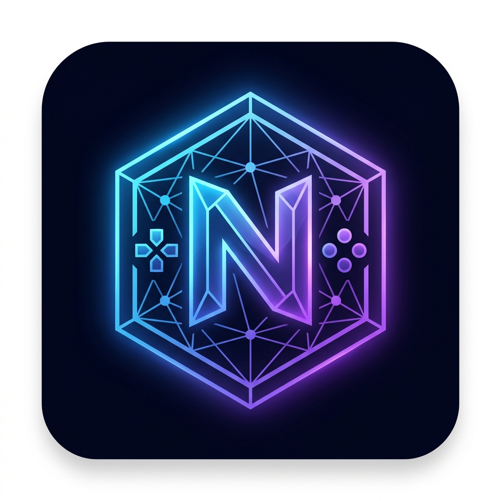

<div align="center">
<<<<<<< HEAD

```
███╗   ██╗███████╗██╗  ██╗██╗   ██╗███████╗
████╗  ██║██╔════╝╚██╗██╔╝██║   ██║██╔════╝
██╔██╗ ██║█████╗   ╚███╔╝ ██║   ██║███████╗
██║╚██╗██║██╔══╝   ██╔██╗ ██║   ██║╚════██║
██║ ╚████║███████╗██╔╝ ██╗╚██████╔╝███████║
╚═╝  ╚═══╝╚══════╝╚═╝  ╚═╝ ╚═════╝ ╚══════╝
     N E T P L A Y   H U B
```

**نظام المحاكاة الشبكي العابر للمنصات**

اتصال P2P مباشر بدون سيرفرات · بدون اشتراكات · مجاني 100%

[](https://github.com/YOUR_USERNAME/nexus-netplay-hub/releases)
[](LICENSE)
[](https://electronjs.org)
[](https://react.dev)
[](https://github.com/YOUR_USERNAME/nexus-netplay-hub/releases)

=======
  

  # Nexus Netplay Hub

  **منصة اللعب الجماعي P2P — بدون سيرفر مركزي**

  [](https://github.com/guest1200assaf-cell/Nexus-Netplay/releases)
  [](LICENSE)
  [](https://github.com/guest1200assaf-cell/Nexus-Netplay/actions)
  [](https://github.com/guest1200assaf-cell/Nexus-Netplay/releases)
>>>>>>> f2a15ce2b0ec8fe19827c78a926291a93c7a800e
</div>

---

## ✨ المزايا

| الميزة | التفاصيل |
<<<<<<< HEAD
|--------|----------|
| 🔗 **اتصال P2P مباشر** | WebRTC عبر Simple-Peer — لا سيرفر وسيط، اتصال مشفر بين اللاعبين |
| 🎙 **Voice Chat محلي** | شات صوتي بجودة 48kHz مع إلغاء الصدى وتقليل الضجيج |
| 💾 **مزامنة Save States** | نقل ملفات الـ Save State تلقائياً قبل بدء اللعبة لضمان التزامن |
| ⚙️ **Config Injection** | يعدّل ملفات `.ini` للمحاكيات برمجياً ويستعيدها عند الإغلاق |
| 🔓 **فتح المنافذ (UPnP)** | يفتح المنافذ في الراوتر تلقائياً لضمان اتصال أخضر |
| 🎮 **دعم Controller** | تنقل في الواجهة بالجوستيك — تجربة كاملة بدون لوحة مفاتيح |
| 🔄 **تحديث تلقائي** | يفحص التحديثات عند الفتح ويثبّتها في الخلفية |
| 🖥 **واجهة PS5** | تصميم مستوحى من PlayStation 5 بتأثيرات Blur وGlow |
=======
|--------|---------|
| 🌐 **P2P Direct** | اتصال مباشر بدون سيرفر وسيط باستخدام WebRTC |
| 👥 **4 لاعبين** | غرف تدعم حتى 4 لاعبين بشبكة Mesh كاملة |
| 🎙 **Voice Chat** | صوت ثنائي الاتجاه مدمج عبر WebRTC Audio |
| 💾 **مزامنة Save-State** | مزامنة نقطة الحفظ بين اللاعبين لبدء منسّق |
| ⚙️ **Config Injection** | ضبط إعدادات المحاكي تلقائياً بدون تعديل يدوي |
| 🎮 **Gamepad Navigation** | تنقل كامل بالـ Controller داخل الواجهة |
| 💬 **شات نصي** | محادثة نصية P2P مباشرة داخل الغرفة |
>>>>>>> f2a15ce2b0ec8fe19827c78a926291a93c7a800e

---

## 🎮 المحاكيات المدعومة

<div align="center">

<<<<<<< HEAD
| المحاكي | المنصة | ملف الإعدادات |
|---------|--------|---------------|
| **PCSX2** | PlayStation 2 | `PCSX2.ini` + `DEV9.ini` |
| **Dolphin** | GameCube / Wii | `Dolphin.ini` |
| **PPSSPP** | PlayStation Portable | `ppsspp.ini` |
=======
| المحاكي | النظام | الحالة |
|---------|--------|--------|
| **PCSX2** | PlayStation 2 | ✅ مدعوم |
| **Dolphin** | GameCube / Wii | ✅ مدعوم |
| **PPSSPP** | PlayStation Portable | ✅ مدعوم |
>>>>>>> f2a15ce2b0ec8fe19827c78a926291a93c7a800e

</div>

---

<<<<<<< HEAD
## 📥 تحميل للمستخدمين

> **لا تحتاج أي خطوات تقنية — فقط حمّل وشغّل**

<div align="center">

| النظام | الرابط |
|--------|--------|
| 🪟 **Windows** (مثبّت) | [تحميل .exe](https://github.com/YOUR_USERNAME/nexus-netplay-hub/releases/latest) |
| 🪟 **Windows** (Portable) | [تحميل مباشر](https://github.com/YOUR_USERNAME/nexus-netplay-hub/releases/latest) |
| 🐧 **Linux** | [تحميل .AppImage](https://github.com/YOUR_USERNAME/nexus-netplay-hub/releases/latest) |
| 🍎 **macOS** | [تحميل .dmg](https://github.com/YOUR_USERNAME/nexus-netplay-hub/releases/latest) |

</div>

---

## 🛠 تثبيت للمطورين

### المتطلبات
- [Node.js](https://nodejs.org) v18 أو أحدث
- [Git](https://git-scm.com)
- npm v9+

### خطوات التثبيت

```bash
# 1. استنسخ المشروع
git clone https://github.com/YOUR_USERNAME/nexus-netplay-hub.git
cd nexus-netplay-hub

# 2. ثبّت المكتبات
npm install

# 3. شغّل وضع التطوير
npm run dev
```

### أوامر البناء

```bash
npm run dev           # تشغيل بوضع التطوير (Vite + Electron)
npm run build:win     # بناء Windows (.exe + Portable)
npm run build:linux   # بناء Linux (.AppImage + .deb)
npm run build:mac     # بناء macOS (.dmg)
npm run obfuscate     # تشويش الكود قبل البناء
npm run release       # بناء + رفع على GitHub Releases
=======
## 📥 التثبيت للمستخدمين

### Windows
1. حمّل `Nexus-Netplay-Setup-x.x.x.exe` من [Releases](https://github.com/YOUR_USERNAME/nexus-netplay-hub/releases)
2. شغّل المثبّت واتبع الخطوات
3. افتح التطبيق من قائمة Start أو سطح المكتب

أو حمّل النسخة المحمولة `Nexus-Netplay-Portable-x.x.x.exe` بدون تثبيت.

---

## 🛠 إعداد بيئة التطوير

### المتطلبات

- Node.js 18+
- أحد المحاكيات: [PCSX2](https://pcsx2.net) / [Dolphin](https://dolphin-emu.org) / [PPSSPP](https://www.ppsspp.org)

### التثبيت

```bash
git clone https://github.com/guest1200assaf-cell/Nexus-Netplay.git
cd Nexus-Netplay
npm install
```

### التشغيل (وضع التطوير)

```bash
# Vite فقط (للتصميم)
npm run dev

# Electron + Vite معاً (التجربة الكاملة)
npm run dev:all
```

---

## 📦 البناء والنشر

```bash
# بناء Windows (NSIS + Portable)
npm run build:win

# رفع Release لـ GitHub تلقائياً
npm run release
```

أو استخدم Git Tags لتشغيل GitHub Actions تلقائياً:

```bash
git tag v1.0.0
git push origin v1.0.0
>>>>>>> f2a15ce2b0ec8fe19827c78a926291a93c7a800e
```

---

## 🏗 هيكل المشروع

```
nexus-netplay-hub/
├── src/
<<<<<<< HEAD
│   ├── main/                    # Electron Main Process
│   │   ├── main.js              # نقطة الدخول
│   │   ├── preload.js           # جسر IPC الآمن
│   │   ├── updater.js           # التحديث التلقائي
│   │   ├── emulators/           # Config Injection لكل محاكي
│   │   ├── ipc/                 # معالجات IPC
│   │   └── network/             # خادم الإشارة المحلي (WebSocket)
│   └── renderer/                # React Frontend
│       ├── pages/               # الصفحات (Home, Lobby, Settings)
│       ├── hooks/               # useP2P, useController, useVoiceChat
│       ├── store/               # Zustand State Management
│       └── components/          # مكونات الواجهة
├── scripts/
│   ├── obfuscate.js             # تشويش الكود
│   └── generate-icons.js        # توليد الأيقونات
├── assets/icons/                # أيقونات المنصات
├── .github/workflows/           # GitHub Actions CI/CD
├── electron-builder.yml         # إعدادات التحزيم
└── package.json
```

---

## 🔧 كيف يعمل

```
┌──────────────────────────────────────────────────────────────┐
│                    Nexus Netplay Hub                         │
│                                                              │
│  ┌─────────────┐  IPC  ┌──────────────────────────────┐    │
│  │ Main Process│◄─────►│     React Renderer (UI)      │    │
│  │             │       │                              │    │
│  │ • Config    │       │  Home → اختيار محاكي        │    │
│  │   Injection │       │  Lobby → غرفة P2P           │    │
│  │ • child_proc│       │  useP2P → WebRTC            │    │
│  │ • UPnP      │       │  useVoiceChat → ميكروفون   │    │
│  │ • WS Server │       │  useFrameSync → مزامنة     │    │
│  └─────────────┘       └──────────────┬───────────────┘    │
│                                       │                      │
└───────────────────────────────────────┼──────────────────────┘
                           WebRTC P2P  │
                    ┌──────────────────▼──────────────────┐
                    │            اللاعب الآخر             │
                    │  Inputs + Voice + Save State Sync   │
                    └─────────────────────────────────────┘
=======
│   ├── main/           # Electron main process
│   │   ├── emulators/  # Config injection (PCSX2, Dolphin, PPSSPP)
│   │   ├── ipc/        # IPC handlers
│   │   ├── network/    # WebSocket signaling + UPnP
│   │   └── updater.js  # Auto-updater
│   ├── renderer/       # React frontend
│   │   ├── components/ # UI components
│   │   ├── hooks/      # useP2P, useVoiceChat, useFrameSync, useController
│   │   ├── pages/      # Home, Lobby, Settings
│   │   └── store/      # Zustand global state
│   └── shared/         # Constants & protocols
└── assets/icons/       # App icons
>>>>>>> f2a15ce2b0ec8fe19827c78a926291a93c7a800e
```

---

## 🤝 المساهمة

<<<<<<< HEAD
نرحب بالمساهمات! راجع [CONTRIBUTING.md](CONTRIBUTING.md) للتفاصيل.
=======
راجع [CONTRIBUTING.md](CONTRIBUTING.md) للتعرف على كيفية إضافة محاكيات جديدة أو تحسين نظام الغرف.
>>>>>>> f2a15ce2b0ec8fe19827c78a926291a93c7a800e

---

## 📄 الرخصة

<<<<<<< HEAD
هذا المشروع مرخص تحت [MIT License](LICENSE) — حر الاستخدام والتعديل والتوزيع.

---

<div align="center">

صُنع بـ ❤️ لمجتمع المحاكيات العربي

⭐ إذا أعجبك المشروع، لا تنسَ النجمة!

</div>
=======
[MIT License](LICENSE) — © 2025 Nexus Team
>>>>>>> f2a15ce2b0ec8fe19827c78a926291a93c7a800e
